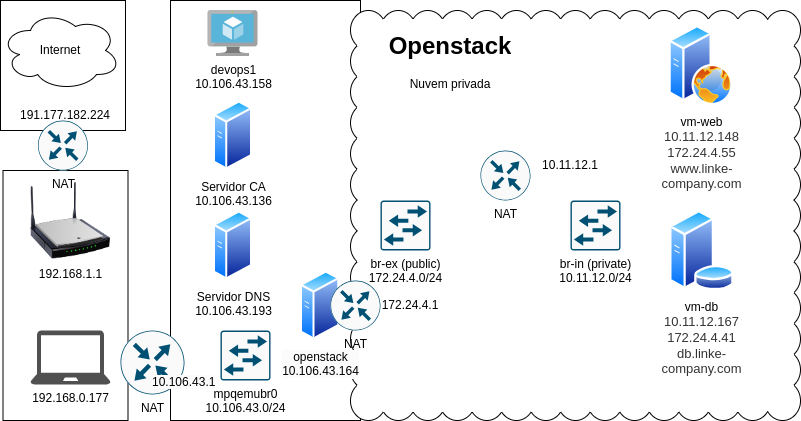

Topologia da Aplicação
======================

Neste documento, discutiremos a topologia da aplicação e as máquinas virtuais necessárias para hospedar toda a aplicação.

Máquinas Necessárias
--------------------

1. **Servidor CA**: Gerencia os certificados de autenticação.
2. **Servidor DNS**: Gerencia as configurações de DNS para a aplicação.
3. **Servidor OpenStack**: Hospeda as máquinas virtuais da aplicação.

   - **Servidor Web no OpenStack**: Hospeda o servidor da aplicação web.

   - **Servidor Banco de Dados no OpenStack**: Armazena os dados da aplicação.

Detalhes das Máquinas Virtuais
------------------------------

Servidor CA
~~~~~~~~~~~~~~~~~~~

- Sistema Operacional: Ubuntu 22.04
- Recursos: 1 CPU, 1GB RAM, 10GB de armazenamento

Servidor DNS
~~~~~~~~~~~~~~~~~~~

- Sistema Operacional: Ubuntu 22.04
- Recursos: 1 CPU, 1GB RAM, 10GB de armazenamento

Servidor OpenStack
~~~~~~~~~~~~~~~~~~~

- Sistema Operacional: Ubuntu 22.04
- Recursos: 4 CPUs, 8GB RAM, 80GB de armazenamento

Servidor Web no OpenStack
~~~~~~~~~~~~~~~~~~~~~~~~~~~~~~~~~~~~~~

- Sistema Operacional: Ubuntu 22.04
- Recursos: Configurado dentro do ambiente OpenStack - 1 CPU, 1GB RAM, 10GB de armazenamento.

Servidor Banco de Dados no OpenStack
~~~~~~~~~~~~~~~~~~~~~~~~~~~~~~~~~~~~~~

- Sistema Operacional: Ubuntu 22.04
- Recursos: Configurado dentro do ambiente OpenStack - 1 CPU, 1GB RAM, 10GB de armazenamento.

Configuração no OpenStack
-------------------------

Para configurar o ambiente no OpenStack, siga os passos abaixo:

1. **Instalação do DevStack**

   - DevStack deve ser instalado na máquina que hospedará o OpenStack. Siga a documentação oficial disponível em:
     `DevStack Installation Guide <https://docs.openstack.org/neutron/latest/contributor/testing/ml2_ovs_devstack.html>`_

2. **Criação de Projeto e Usuários**

   - No OpenStack, crie um novo projeto que representará a aplicação.
   - Crie os usuários que terão acesso ao projeto.
   - Atribua roles (perfis) adequadas aos usuários e vincule-os ao projeto criado.

3. **Configuração das Redes**

   - Configure uma rede privada que será utilizada para hospedar as máquinas virtuais da aplicação.
   - Crie um roteador que conectará a rede privada à rede pública, permitindo que as máquinas virtuais na rede privada possam acessar a internet.

4. **Criação de Máquinas Virtuais**

   - Dentro da rede privada, crie as máquinas virtuais necessárias, incluindo o servidor web e o servidor de banco de dados.
   - Associe IPs flutuantes (floating IPs) da rede pública às máquinas virtuais, permitindo que sejam acessadas externamente.

5. **Configurações de Segurança e Acesso**

   - Adicione grupos de segurança que liberem as portas necessárias para o funcionamento da aplicação, incluindo portas para SSH, HTTP/HTTPS e MySQL.
   - Configure o acesso SSH às máquinas virtuais, garantindo que você possa acessá-las remotamente de forma segura.

A topologia resultante deve ficar similar à mostrada na figura abaixo:

